# UrbanCart — SQL Analysis

This document contains the SQL business questions, queries, outputs, and brief explanations from the UrbanCart e-commerce analytics project.

---

## Table of Contents

- [Level 1 — Beginner SQL](#level-1--beginner-sql)
- [Level 2 — Intermediate SQL](#level-2--intermediate-sql)
- [Level 3 — Advanced SQL](#level-3--advanced-sql)
- [SQL Concepts Used](#sql-concepts-used)

---

# Level 1 — Beginner SQL

## Q1. [total orders, total customers, and total distinct products]

### Business Question
> [How many total orders, total customers, and total distinct products does UrbanCart have?]

### SQL Query

```sql
SELECT
(SELECT count(*) from customers) as total_customers,
(SELECT count(*) from products) as total_products,
(SELECT count(*)FROM orders) as total_orders;
```

### Output

<!-- Add screenshot here -->

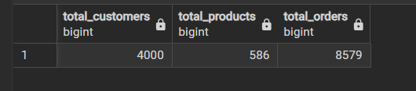


## Q2. [ top 10 product categories]

### Business Question
> [What are the top 10 product categories by total quantity sold?]

### SQL Query

```sql
SELECT p.category, SUM(oi.quantity) AS total_quantity
from order_items oi
JOIN products p ON
p.product_id = oi.product_id
GROUP BY p.category
ORDER BY total_quantity DESC
```

### Output

<!-- Add screenshot here -->

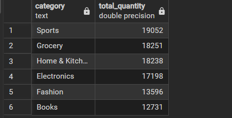


---

## Q3. [Order Status]

### Business Question
> [ What percentage of orders fall into each `order_status` (Delivered/Cancelled/Returned/etc.)?
]

### SQL Query

```sql
SELECT order_status,
	count(*) AS n,
	round(100.0*count(*) / sum(count(*)) OVER(), 2) AS pct
FROM orders
GROUP BY order_status
order by pct DESC
```

### Output

<!-- Add screenshot here -->

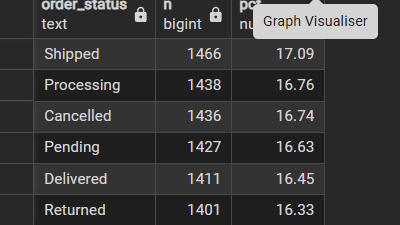


---

## Q4. [10 customers who have placed the most orders]

### Business Question
> [ List the 10 customers who have placed the most orders, along with their city and segment.
]

### SQL Query

```sql
SELECT c.customer_id, c.customer_name, c.city, c.customer_segment, count(o.order_id) AS num_orders
FROM customers c
JOIN orders o ON o.customer_id = c.customer_id
GROUP BY c.customer_id, c.customer_name, c.city, c.customer_segment
ORDER BY num_orders DESC
LIMIT 10;
```

### Output

<!-- Add screenshot here -->

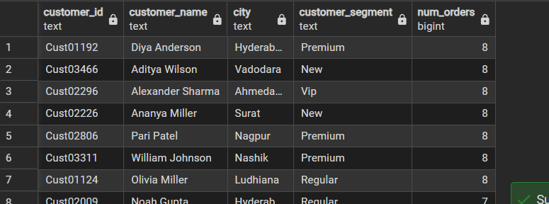

---

## Q5. [ average unit price per product category]

### Business Question
> [What is the average unit price per product category?
]

### SQL Query

```sql
select category, round(AVG(unit_price)) as avg_unit_price from products
GROUP BY category
ORDER BY avg_unit_price DESC
```

### Output

<!-- Add screenshot here -->

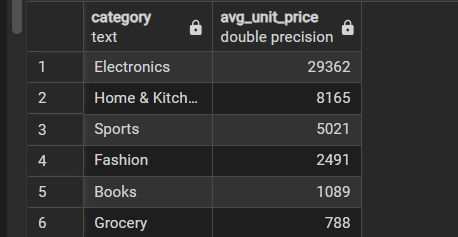


---

## Q6. [highest number of orders]

### Business Question
> [ Which 5 cities have generated the highest number of orders?
]

### SQL Query

```sql
SELECT c.city, count(o.order_id) AS total_orders
from orders o
JOIN customers c ON
c.customer_id = o.customer_id
GROUP BY c.city
ORDER BY total_orders DESC
LIMIT 5;

```

### Output

<!-- Add screenshot here -->

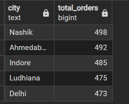


---

## Q7. [Most common payment mode]

### Business Question
> [Which payment mode is most commonly used, and does that vary by customer segment?
]

### SQL Query

```sql
WITH mode_counts AS (
select c.customer_segment, o.payment_mode, count(*) AS n,
RANK() OVER (PARTITION BY c.customer_segment ORDER BY COUNT(*) DESC) AS rnk
FROM orders o
JOIN customers c ON c.customer_id = o.customer_id
GROUP BY c.customer_segment, o.payment_mode
)
SELECT customer_segment, payment_mode, n
FROM mode_counts
WHERE rnk=1
ORDER BY customer_segment
```

### Output

<!-- Add screenshot here -->

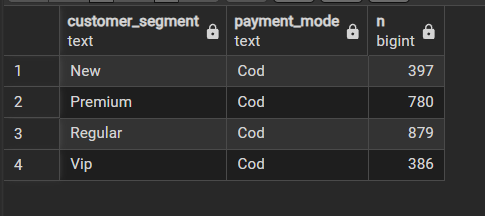


---

# Level 2 — Intermediate SQL

## Q8. [month-over-month total revenue]

### Business Question
> [ What is the month-over-month total revenue (quantity × unit price × (1-discount)) trend for 2023?
]

### SQL Query

```sql
SELECT 
DATE_TRUNC('month', o.order_date) AS month,
ROUND(SUM(oi.quantity*p.unit_price*(1-oi.discount_pct/100.0))) as revenue
from orders o
join order_items oi ON oi.order_id = o.order_id
JOIN products p ON p.product_id = oi.product_id
WHERE EXTRACT(YEAR FROM o.order_date)= 2023
GROUP BY month
ORDER BY month

```

### Output

<!-- Add screenshot here -->

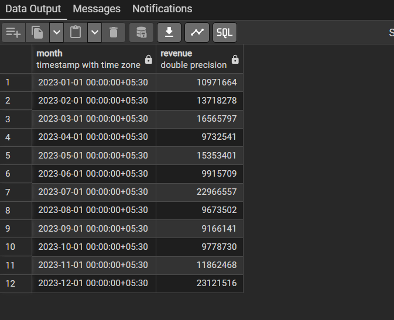


---

## Q9. [ highest total order value by warehouse]

### Business Question
> [Which warehouse has shipped the highest total order value? Which has the lowest?
]

### SQL Query

```sql
WITH warehouse_totals AS(
SELECT  o.warehouse_id, w.warehouse_name, COUNT(o.order_id) AS total_orders, ROUND(SUM(oi.quantity * p.unit_price* (1- discount_pct/100.0))) as total_order_value
FROM orders o 
JOIN order_items oi ON o.order_id = oi.order_id
JOIN products p ON oi.product_id = p.product_id
JOIN warehouses w ON o.warehouse_id = w.warehouse_id
GROUP BY o.warehouse_id, w.warehouse_name
ORDER BY total_order_value DESC;
)

(select * , 'Highest' AS label FROM warehouse_totals order by total_order_value LIMIT 1;)UNION ALL
(select*, '')
```


---

## Q10. [highest average discount given]

### Business Question
> [ Which product categories have the highest average discount given, and does that correlate with lower or higher total revenue?]

### SQL Query

```sql
SELECT p.category, round(AVG(oi.discount_pct::numeric), 2) AS avg_discount,
ROUND(SUM(oi.quantity * p.unit_price* (1- discount_pct/100.0))) as total_order_value
FROM order_items oi 
JOIN products p ON oi.product_id = p.product_id
GROUP BY p.category
ORDER BY avg_discount DESC;
```

### Output

<!-- Add screenshot here -->

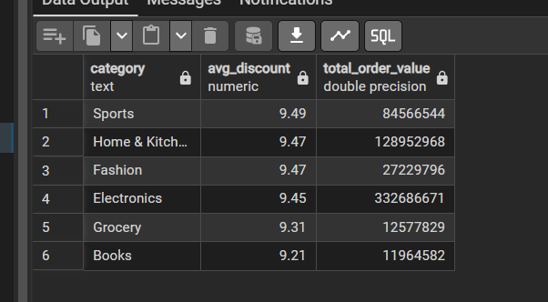


---

## Q11. [customers who never placed a order]

### Business Question
> [Find all customers who have never placed a single order (i.e., exist in `customers` but not in `orders`)]

### SQL Query

```sql
SELECT c.customer_id, c.customer_name from customers c
LEFT JOIN orders o ON c.customer_id = o.customer_id 
WHERE o.order_id IS NULL
```

### Output

<!-- Add screenshot here -->

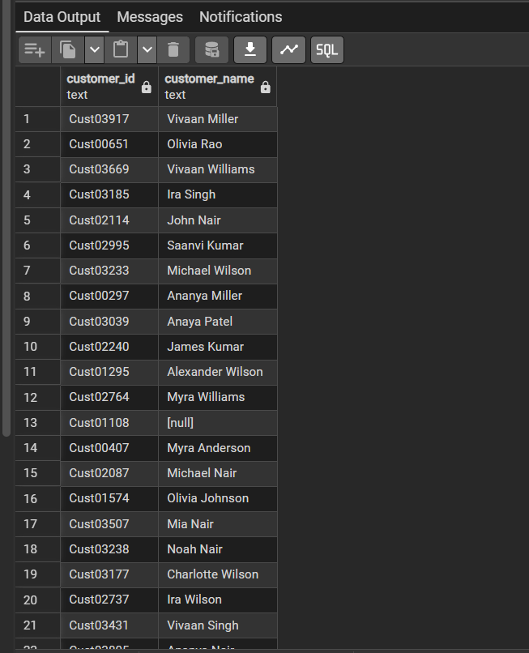


---

## Q12. [highest total revenue generated]

### Business Question
> [Which suppliers have products with the highest total revenue generated (join supplier → product → order_items)?
]

### SQL Query

```sql
select ROUND(SUM(oi.quantity*p.unit_price*(1-oi.discount_pct/100.0))) as revenue, s.supplier_name
from products p 
join suppliers s ON s.supplier_id = p.supplier_id
JOIN order_items oi ON oi.product_id = p.product_id
group by s.supplier_name
ORDER by revenue DESC
LIMIT 5;
```

### Output

<!-- Add screenshot here -->

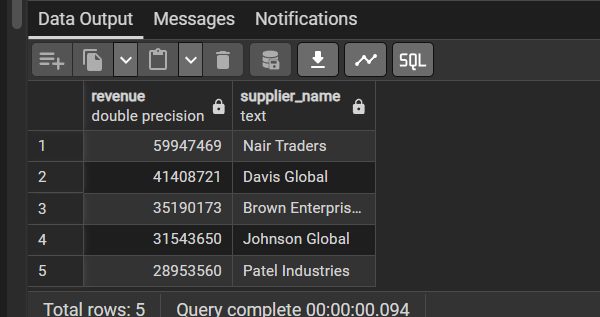


---

# Level 3 — Advanced SQL

## Q13. [most recent order date for each customer]

### Business Question
> [For each customer, find their most recent order date and how many days ago that was, relative to the most recent order date in the whole dataset
]

### SQL Query

```sql
SELECT
	CUSTOMER_ID,
	MAX(ORDER_DATE) AS LATEST_ORDER,
	MAX(ORDER_DATE) - (
		SELECT
			MAX(ORDER_DATE)
		FROM
			ORDERS
	) AS DAYS_AGO
FROM
	ORDERS
GROUP BY
	CUSTOMER_ID
ORDER BY
	DAYS_AGO DESC
```


### Key SQL Concept

[MAX, GROUP BY, ORDER BY]

---

## Q14. 

### Business Question
> [Rank products within each category by total revenue using `RANK()` or `DENSE_RANK()`, and return only the top 3 per category.]


### SQL Query

```sql
WITH product_revenue AS (
  SELECT p.category, p.product_id, p.product_name,
         ROUND(SUM(
           COALESCE(oi.quantity, 0) * COALESCE(p.unit_price::numeric, 0) * (1 - COALESCE(oi.discount_pct, 0)/100.0)
         )) AS revenue
  FROM products p
  JOIN order_items oi ON oi.product_id = p.product_id
  GROUP BY p.category, p.product_id, p.product_name
),
ranked_products AS (
  SELECT *, DENSE_RANK() OVER (PARTITION BY category ORDER BY revenue DESC) AS revenue_rank
  FROM product_revenue
)
SELECT category, product_id, product_name, ROUND(revenue::numeric, 2) AS revenue, revenue_rank
FROM ranked_products
WHERE revenue_rank <= 3
ORDER BY category, revenue_rank;
```

### Output

<!-- Add screenshot here -->

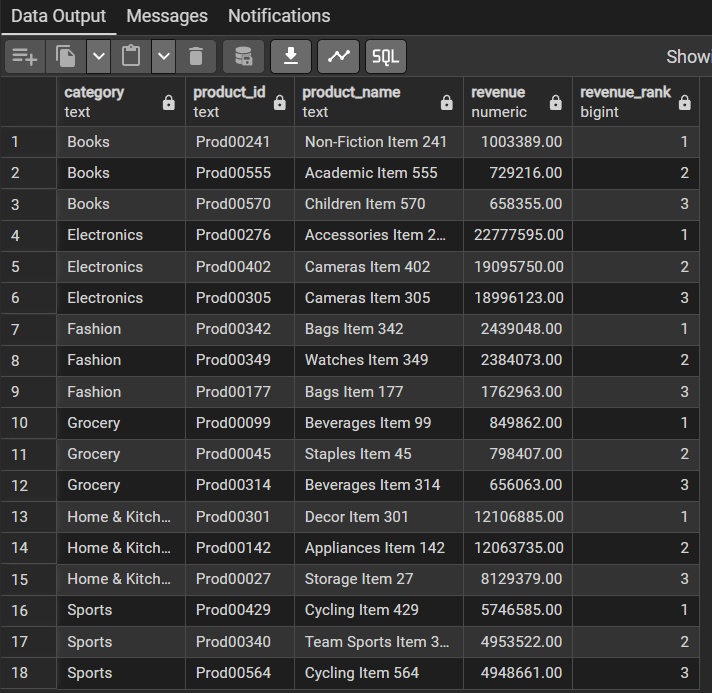


### Key SQL Concept

[SUM, COALESCE, DENSE_RANK, PARTITION BY, JOIN]

---

## Q15.

### Business Question
> [Using a CTE, calculate each customer's total lifetime spend,
then bucket customers into `High` / `Medium` / `Low` spend tiers using `NTILE(3)` or `CASE`.]

### SQL Query

```sql
WITH customer_spend AS (
select o.customer_id, 
sum(COALESCE(oi.quantity, 0) * COALESCE(p.unit_price, 0) * (1- COALESCE(oi.discount_pct, 0)/100.0)) AS lifetime_spend
FROM orders o 
JOIN order_items oi ON oi.order_id = o.order_id
JOIN products p  ON p.product_id = oi.product_id
GROUP BY o.customer_id
)

SELECT customer_id, lifetime_spend,
NTILE(3) OVER (order by lifetime_spend DESC) AS spend_tier_numeric,


CASE NTILE(3) OVER (order by lifetime_spend DESC)
WHEN 1 THEN 'HIGH'
WHEN 2 THEN 'MEDIUM'
ELSE 'LOW'

END AS spend_tier
FROM customer_spend
ORDER BY lifetime_spend DESC;
```

### Output

<!-- Add screenshot here -->

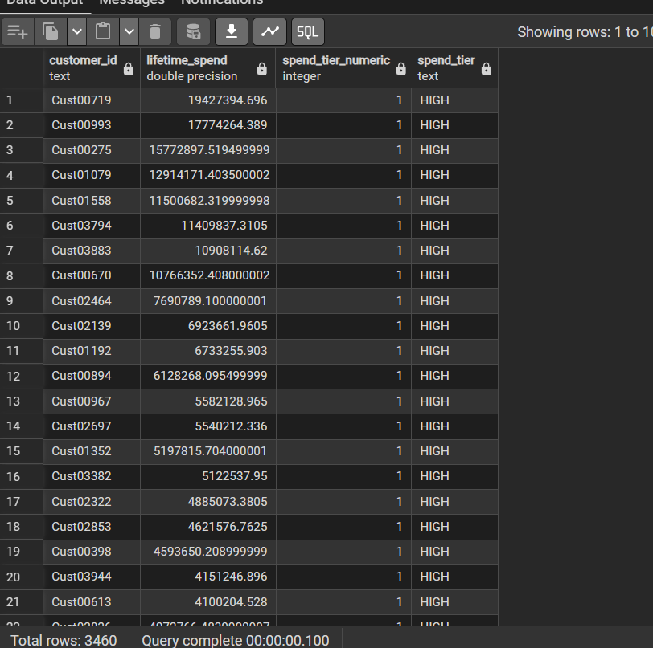


### Key SQL Concept

[COALESCE, NTILE, CASE]

---

## Q16.

### Business Question
> [Calculate a running (cumulative) monthly revenue total for 2023 using a window function (`SUM() OVER (ORDER BY month)`).
]

### SQL Query

```sql
with monthly as (
select DATE_TRUNC('month', o.order_date) AS month,
sum(COALESCE(oi.quantity, 0) * COALESCE(p.unit_price, 0) * (1- COALESCE(oi.discount_pct, 0)/100.0)) AS revenue
FROM orders o 
join order_items oi ON oi.order_id = o.order_id
JOIN products p ON p.product_id = oi.product_id
WHERE EXTRACT(YEAR FROM o.order_date) = 2023
group by month
)

SELECT month, revenue, 
sum(revenue) OVER(ORDER BY MONTH) AS cumulative_revenue
from monthly
order by month;
```

### Output

<!-- Add screenshot here -->

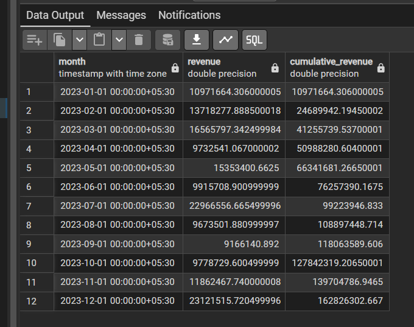


### Key SQL Concept

[COALESCE, EXTRACT, OVER, WHERE]

---

## Q17. 

### Business Question
> [Find the month-over-month % growth in orders using `LAG()`.
]

### SQL Query

```sql
WITH monthly_orders AS (
 select DATE_TRUNC('month', order_date) AS month, count(*) AS n_orders
 FROM orders
 group by month
)

SELECT month, n_orders,
LAG(n_orders) OVER (ORDER BY month) AS prev_month_orders,
ROUND(100.0 * (n_orders - LAG(n_orders) OVER (ORDER BY month)) / NULLIF(LAG(n_orders) OVER (ORDER BY month), 0)
, 2)  AS pct_growth
from monthly_orders
order BY month

```

### Output

<!-- Add screenshot here -->

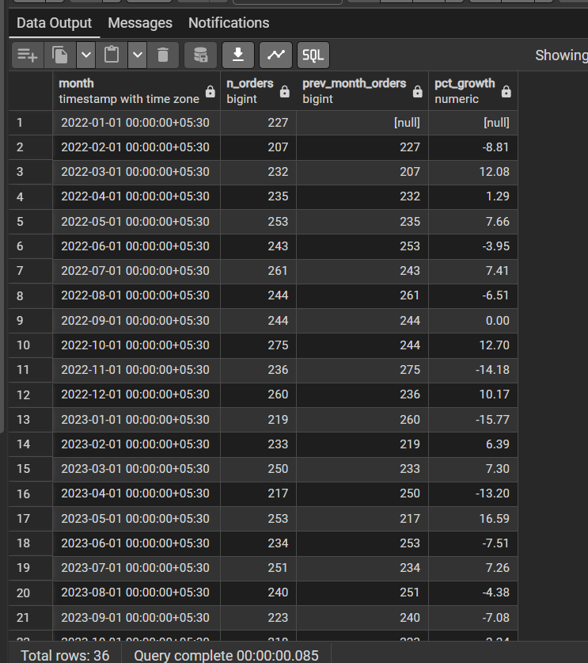


---

## Q18.

### Business Question
> [Identify products that are "at risk" — defined as: appear in `order_items` but have had zero orders in the last 6 months of the dataset's date range (use a subquery/anti-join with a date filter).
]

### SQL Query

```sql
with max_date AS (select MAX(order_date) AS 
d from orders),

recent_products AS (
select DISTINCT oi.product_id
from order_items oi
JOIN orders o ON o.order_id = oi.order_id
where o.order_date >= (select d from max_date) - INTERVAL '6 months'
)
select p.product_id, p.product_name, p.category
from products p 
where p.product_id NOT IN (select product_id from recent_products);
```

### Output

<!-- Add screenshot here -->


### Key SQL Concept

[MAX, DISTINCT, INTERVAL, NOT IN ]

---

## Q19. 

### Business Question
> [For each order, calculate what % of that order's total value came from the single most expensive line item (window function `PARTITION BY order_id`).]

### SQL Query

```sql
WITH line_values AS (
select oi.order_id ,     oi.order_item_id, 
COALESCE(oi.quantity, 0)* COALESCE(p.unit_price, 0) * (1- COALESCE(oi.discount_pct, 0)/100.0) AS line_value
FROM order_items oi
JOIN products p ON p.product_id = oi.product_id
),

order_stats AS (
 SELECT * , 
 SUM(line_value) OVER (PARTITION BY order_id) AS order_total,
 MAX(line_value) OVER (PARTITION BY order_id) AS max_line_value
 FROM line_values
)

SELECT DISTINCT order_id, order_total, max_line_value,
ROUND(100.0 * max_line_value/ NULLIF(order_total,0)) AS pct_from_top_item
FROM order_stats
ORDER BY pct_from_top_item DESC NULLS LAST;
```

### Output

<!-- Add screenshot here -->

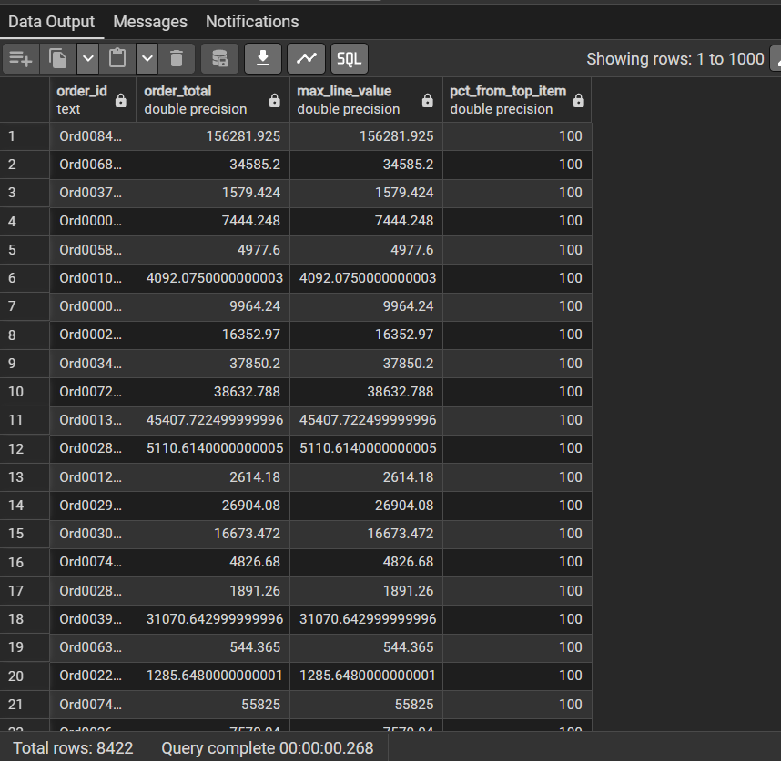


### Key SQL Concept

[COALESCE. OVER, PARTITION, MAX, NULL LAST]

---

## Q20. 

### Business Question
> [Build a supplier scorecard: for each supplier, compute total revenue generated,average reliability_score, and average lead_time_days, then rank suppliers by a simple composite score you define (explain your weighting logic in a markdown note — there's no single right answer, but you must justify it).]

### SQL Query

```sql
WITH supplier_perf  AS (
SELECT s.supplier_id, s.supplier_name, s.reliability_score, s.lead_time_days,
sum(COALESCE(oi.quantity, 0) * COALESCE(p.unit_price, 0) * (1- COALESCE(oi.discount_pct, 0)/100.0)) AS total_revenue
from suppliers s
JOIN products p ON p.supplier_id = s.supplier_id
JOIN order_items oi ON oi.product_id = p.product_id
GROUP BY s.supplier_id, s.supplier_name, s.reliability_score, s.lead_time_days
)

SELECT *, ROUND((
0.5* PERCENT_RANK() OVER (ORDER BY total_revenue) + 
0.3 * (coalesce(reliability_score, 0) / 100.0) + 
0.2 * (1- PERCENT_RANK() OVER (ORDER BY lead_time_days)))::numeric, 3) AS composite_score
FROM supplier_perf
ORDER BY composite_score DESC;
```

### Output

<!-- Add screenshot here -->

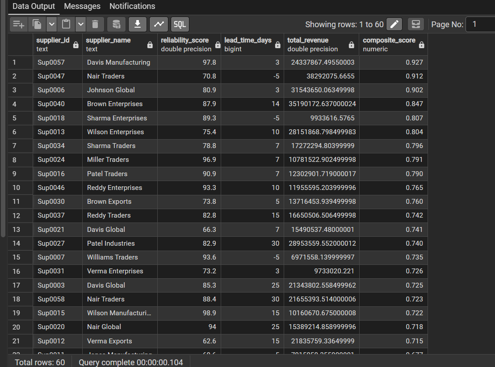


### Key SQL Concept

[PERCENT_RANK, ORDER BY, OVER]

---

# SQL Concepts Used

| Concept | Where Used | Purpose |
|---|---|---|
| `SELECT` | [Q] | Retrieve required columns |
| `WHERE` | [Q] | Filter records |
| `GROUP BY` | [Q] | Aggregate data by groups |
| `ORDER BY` | [Q] | Sort results |
| `JOIN` | [Q] | Combine related tables |
| `LEFT JOIN` | [Q] | Keep unmatched records |
| `CTE (WITH)` | [Q] | Create intermediate query results |
| `CASE` | [Q] | Conditional logic |
| `COUNT()` | [Q] | Count records |
| `SUM()` | [Q] | Calculate totals |
| `AVG()` | [Q] | Calculate averages |
| `ROUND()` | [Q] | Round numeric results |
| `DATE_TRUNC()` | [Q] | Group dates by time period |
| `EXTRACT()` | [Q] | Extract date components |
| `RANK()` | [Q] | Rank rows within groups |
| `DENSE_RANK()` | [Q] | Rank rows without gaps |
| `NTILE()` | [Q] | Divide rows into groups |
| `LAG()` | [Q] | Compare with previous row |

---

# Overall SQL Learning

[

- Started with basic aggregations and filtering.
- Progressed to multi-table joins and date-based analysis.
- Used CTEs to break complex problems into steps.
- Used window functions for ranking, segmentation and time-based comparisons.
- Applied SQL to practical e-commerce business problems.
]
